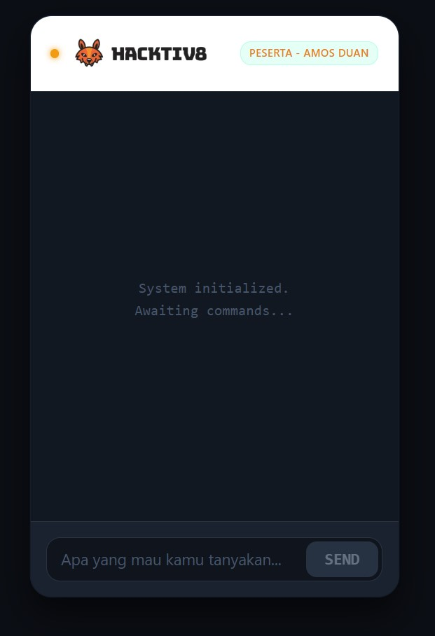

# 🤖📈 CryptoAssist: Your Web3 & AI Companion

[](https://reactjs.org/)
[](https://vitejs.dev/)
[](https://ai.google.dev/)
[](https://www.gnu.org/licenses/gpl-3.0)

**CryptoAssist** adalah aplikasi *chatbot* berbasis kecerdasan buatan (AI) bergaya *mobile-first* yang dirancang secara khusus untuk menjadi asisten ahli di bidang Web3, Blockchain, Trading, dan Cryptocurrency. Aplikasi ini memanfaatkan model bahasa mutakhir **Google Gemini 2.0 Flash** dengan antarmuka bertema *dark mode* dan *neon glow* khas industri kripto.


---

## 🎓 Tentang Proyek (Maju Bareng AI)

Proyek ini dikembangkan oleh **Amos Duan Nugroho** sebagai **Final Project dan Portofolio Akhir** dari program pelatihan **Maju Bareng AI**. 

Maju Bareng AI adalah inisiatif luar biasa (bagian dari *AI Opportunity Fund: Asia Pacific*) yang dirancang untuk membekali talenta digital dengan keterampilan AI yang relevan dengan kebutuhan industri masa kini. Program ini terwujud berkat kolaborasi antara:
* **Hacktiv8**
* **Google.org**
* **Asian Development Bank (ADB)**
* **AVPN**

Baik bagi IT developer yang ingin meningkatkan daya saing, maupun pencari kerja yang ingin masuk ke industri teknologi, kredibilitas dari program ini menjadi fondasi utama dalam pembuatan CryptoAssist.

---

## ✨ Fitur Utama

- **🧠 Persona AI Khusus Web3:** Memanfaatkan *System Instructions* pada Gemini API, bot diprogram untuk hanya membahas topik kripto, *smart contract*, NFT, dan Web3. Topik di luar itu akan ditolak dengan sopan ala *crypto bro*.
- **⚡ Real-time Streaming (SSE):** Menerima respons teks dari AI secara sepotong-sepotong (*chunk stream*), memberikan pengalaman *chat* yang instan tanpa waktu tunggu yang lama.
- **📱 Mobile-First UI/UX:** Antarmuka responsif berbentuk perangkat *mobile* dengan navigasi vertikal tanpa batas (*infinite scroll*) dan kotak input yang selalu menempel di bawah (*sticky bottom*).
- **📝 Render Markdown & Tabel:** Mendukung penuh format penulisan *markdown* (via `react-markdown` dan `remark-gfm`), sehingga kode *smart contract* atau tabel analisis koin dapat ditampilkan dengan rapi.
- **🛡️ Custom Error Handling:** Menangkap *error* jaringan atau pembatasan kuota (*Rate Limit 429*) dan menampilkannya sebagai log terminal agar mudah dipahami pengguna.
- **💾 Local Storage Persistence:** Riwayat obrolan secara otomatis disimpan di *browser* (Local Storage), sehingga obrolan tidak hilang saat halaman di-*refresh*.

---

## 🛠️ Tech Stack (Teknologi yang Digunakan)

* **Frontend Framework:** React.js (v18+)
* **Build Tool:** Vite
* **AI Engine:** `@google/generative-ai` SDK (Model: `gemini-2.0-flash`)
* **Styling:** Custom CSS & Bootstrap 5
* **Markdown Parser:** `react-markdown`, `remark-gfm`

---

## 🚀 Panduan Instalasi & Menjalankan Aplikasi

Ikuti langkah-langkah di bawah ini untuk menjalankan proyek ini di mesin lokal Anda:

### 1. Prasyarat (Prerequisites)
Pastikan Anda sudah menginstal:
- [Node.js](https://nodejs.org/) (Versi 18 atau lebih baru)
- Git

### 2. Clone Repositori
```bash
git clone [https://github.com/USERNAME_GITHUB_ANDA/majubarengAI_Hacktiv8_AmosDuan_FinalProject.git](https://github.com/USERNAME_GITHUB_ANDA/majubarengAI_Hacktiv8_AmosDuan_FinalProject.git)

cd majubarengAI_Hacktiv8_AmosDuan_FinalProject

cryptoassist/
├── public/                 # Asset statis publik
├── src/
    ├── assets/ 
│   ├── App.jsx             # Komponen Utama React & UI Logic
│   ├── App.css             # Custom styling (Dark mode, Crypto theme)
│   ├── gemini.js           # Konfigurasi Google Generative AI SDK & Streaming Logic
│   └── main.jsx            # Entry point aplikasi
├── .env                    # Environment variables 
├── .gitignore              # Daftar file yang diabaikan Git
├── index.html              # Template HTML utama
├── package.json            # Daftar dependensi dan scripts npm
├── README.md               # Dokumentasi proyek (File ini)
└── vite.config.js          # Konfigurasi bundler Vite
